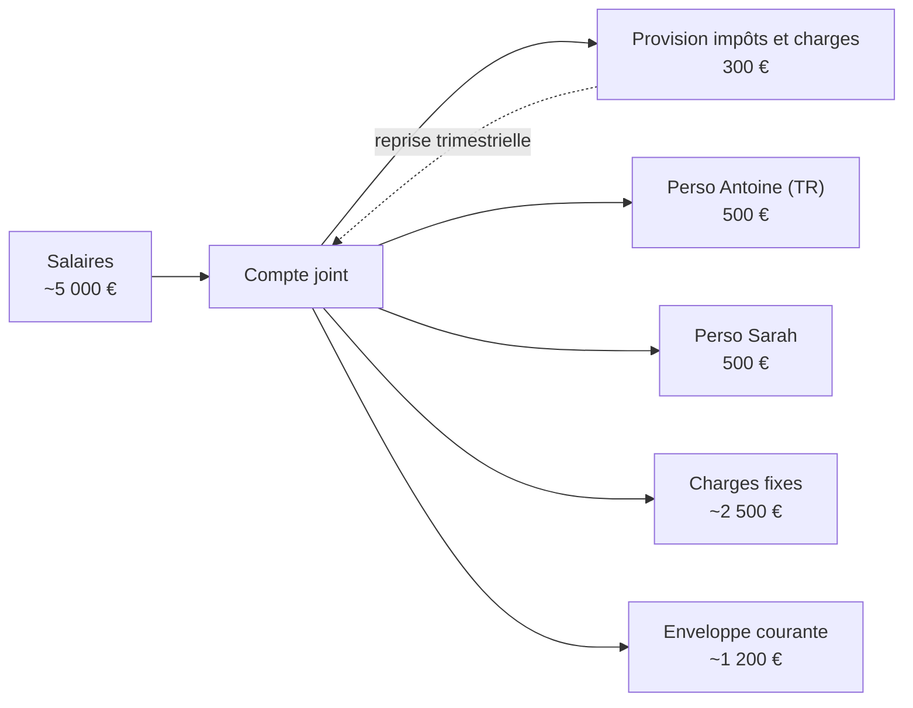
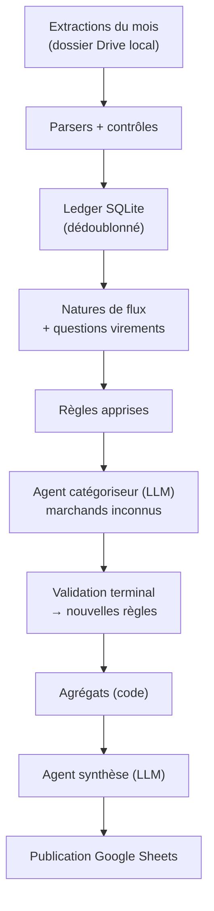

# Cadrage — Budget Tracker agentique (Projet 2)

Sep 23, 2026 · @Antoine

## 1. Contexte et objectifs

Chaque mois, l'agent transforme trois extractions bancaires en un suivi des dépenses du foyer publié dans un Google Sheet, avec une vue compte joint et une vue compte perso.

**Objectif d'apprentissage** : pratiquer avec PydanticAI la sortie structurée, le human-in-the-loop persistant (mémoire des décisions).

**Objectif fonctionnel** : répondre chaque mois à trois questions.

1. Combien dépense-t-on par rapport à l'enveloppe prévue, en joint et en perso ?
2. Quelle catégorie pèse le plus, et sur laquelle peut-on agir ?
3. À quels moments de l'année le budget explose-t-il, et pourquoi ?

**Posture assumée** : environ 80 % du projet est de l'ETL déterministe (parsing, contrôles, agrégats). Le LLM n'intervient qu'à deux endroits : catégoriser les marchands inconnus et commenter des chiffres déjà calculés par le code.

## 2. Périmètre

Le MVP couvre toute la chaîne, de l'import jusqu'au Google Sheet. Il est lancé à la main et pose ses questions dans le terminal.

**MVP**

- Import des trois extractions d'un mois depuis un dossier local.
- Parsing déterministe avec contrôles bloquants, puis stockage dans un ledger SQLite dédoublonné.
- Classement de chaque opération : nature de flux, puis catégorie (règles, puis LLM, puis validation humaine).
- Question obligatoire sur tout virement entre comptes non couvert par une règle.
- Mémoire des décisions : règles apprises en base et journal lisible en Markdown.
- Agrégats calculés par le code, puis synthèse rédigée par le LLM.
- Publication dans Google Sheets : onglet Synthèse et un onglet par mois.

**Phase 2**

- Publication dans le Sheet et dépôt sur Google Drive.
- Déclenchement automatique par surveillance du dossier Drive.
- Agent analyste doté d'outils de lecture du ledger, pour creuser le « pourquoi » d'un dépassement.

**Hors périmètre**

- Import du compte perso de Sarah, du compte épargne, des livrets et des enveloppes PEA/CTO. Seuls les flux vers ou depuis ces comptes sont visibles.
- Vue consolidée du foyer (joint et perso additionnés).
- Suivi de patrimoine et de performance des investissements.

## 3. Sources de données

Les trois sources sont parsables de façon déterministe, et chacune dispose d'un contrôle de cohérence. Les deux contrôles chiffrés ont été vérifiés sur les fichiers de juin 2026.

| Source | Format | Période couverte | Volume (juin) | Contrôle bloquant |
| --- | --- | --- | --- | --- |
| CA cartes (X1091, X1481) | CSV cp1252, séparateur `;`, une section par carte | Achats du 19 M-1 au 18 M environ, débités fin M | 48 opérations | Net de chaque carte égal à la ligne « Prélèvement carte » du joint, au centime (3 116,50 € et 410,67 € : OK) |
| CA compte joint | CSV cp1252, `;`, libellés multi-lignes | Du 1er à la fin du mois M | 38 opérations | Chaque ligne a une date et un seul montant ; une ligne de débit différé par carte active |
| Trade Republic compte courant | PDF de 8 pages contenant 3 relevés (compte courant et 2 PEA) | Du 1er à la fin du mois M | 74 opérations | Solde recalculé ligne à ligne, et totaux égaux à la synthèse du relevé (entrées 993,71 €, sorties 1 435,36 €) |

**Pièges du Crédit Agricole**

- Encodage cp1252, fins de ligne CRLF et LF mélangées, blocs d'en-tête à ignorer, une section par carte.
- Libellé du joint sur plusieurs lignes : la ligne 1 donne le type d'opération, la ligne 2 le détail, les suivantes les références SEPA (RUM, identifiant créancier ICS).
- Montants hétérogènes : `550`, `4,8`, `1 071,04`, et `-3 116.50` avec un point dans l'en-tête des cartes.
- Des lignes de l'ancienne carte X9817 peuvent encore apparaître sur le joint (avoir, remboursement de cotisation).

**Pièges de Trade Republic**

- Le parsing texte naïf est exclu : « CARREFOUR CITY 2466078 6,45 € » est lu comme 24 660 786,45 €.
- Le parsing se fait par position de colonne, en repérant l'abscisse des en-têtes ENTRÉE, SORTIE et SOLDE sur chaque page. Le prototype a lu 73 opérations sur 74, et le contrôle de solde a détecté la 74e (DECATHLON 409,97 €).
- Le type « Avoir » désigne tout paiement carte, dans les deux sens. Le sens se lit dans la colonne, jamais dans le type.
- Dates et descriptions s'étalent sur deux lignes. Les sections PEA sont ignorées.

**Complétude** : un mois M ne peut être traité qu'une fois ses trois fichiers présents, c'est-à-dire à partir du 1er du mois M+1.

## 4. Modèle de classement

Chaque opération reçoit une nature de flux et, si c'est une dépense ou un flux lié à une dépense, une catégorie à deux niveaux.

**Natures de flux**

| Nature | Définition | Exemples de juin | Effet sur les indicateurs |
| --- | --- | --- | --- |
| Dépense | Sortie consommée | Carrefour, prêt, Pajemploi | Dépenses du compte |
| Revenu | Salaire, revenu financier ou revenu exceptionnel | GROUPAMA VIRT.APTS, dividendes, intérêts | Revenus du mois de paie |
| Dotation | Virement mensuel prévu vers un compte perso ou la provision | 500 € « Mensuel » vers TR, 300 € vers la provision | Sortie planifiée, hors dépenses |
| Provision | Reprise depuis la provision, et paiement qu'elle finance | 1 071 € reçus, puis SOPAGI 1 071,04 € | Neutralisé |
| Épargne | Vers ou depuis l'épargne et les investissements | DCA, arrondis, Versement PEA | Indicateur d'épargne (désépargne en négatif) ; les investissements TR consomment aussi l'enveloppe perso |
| Complément | Virement ponctuel pour renflouer un compte hors budget | Virement du joint vers TR hors dotation | Affiché comme dépassement financé |
| Lien à une dépense | Flux qui finance ou rembourse une dépense précise | 250 € « Velo » du joint vers TR | Prend la catégorie de la dépense liée |
| Remboursement | Avoir marchand ou remboursement de mutuelle | Zalando 51 €, MANOMANO 199,99 €, IGESTION-BCAC 77,90 € | Déduit de la catégorie d'origine |
| Hors budget | Échanges entre personnes, clôtures de comptes, dépôt de garantie | Wero 10 €, clôture BNPP 473,16 €, dépôt 1 806 € | Listé à part |
| Neutralisé | Doublon technique | Lignes de débit différé des cartes | Exclu |

**Catégories (validées pour démarrer)**

| Catégorie | Sous-catégories | Nature |
| --- | --- | --- |
| Logement | Prêt, Charges copropriété, Assurance habitation | Fixe|
| Enfants | Garde, Vêtements & équipement, Activités | Mixte |
| Impôts | Impôt sur le revenu, Taxe foncière | Fixe |
| Abonnements | Énergie, Internet & mobile, Streaming & musique, Logiciels & IA, Frais bancaires | Fixe |
| Courses | Supermarché, Commerces de bouche | Pilotable |
| Restos & commandes | Restaurant, Livraison, Cafés & snacks | Pilotable |
| Loisirs | Sorties, Sport, Jeux & apps, Voyages | Pilotable |
| Achats | Vêtements, Maison & déco, High-tech, Divers | Pilotable |
| Transport | Carburant, Transports en commun, Parking & péages, Entretien véhicule, Train & avion | Mixte |
| Santé | Pharmacie, Consultations, Optique | Mixte |
| Cadeaux & dons | Cadeaux, Dons | Pilotable |

La colonne Nature est portée par chaque sous-catégorie. C'est elle qui permet d'isoler les dépenses sur lesquelles on peut agir.

## 5. Structure budgétaire du foyer

Le joint reçoit environ 5 000 € de salaires. Une fois retirés les dotations (1 300 €) et les charges fixes (environ 2 500 €), il reste une enveloppe courante d'environ 1 200 € par mois.



Les flèches pleines sont les flux mensuels ; la flèche pointillée est la reprise trimestrielle qui finance les charges de copropriété.

| Poste | Montant mensuel | Suivi dans l'outil |
| --- | --- | --- |
| Salaires sur le joint | \~5 000 € | Revenus rattachés à leur mois de paie |
| Dotation provision (épargne impôts et charges) | 300 € | Dotation ; les reprises et les paiements financés sont neutralisés |
| Dotation perso Antoine (Trade Republic) | 500 € | Dotation ; tout virement au-delà déclenche une question |
| Dotation perso Sarah | 500 € | Dotation ; tout virement au-delà déclenche une question |
| Charges fixes | \~2 500 € | Montant réel comparé au montant attendu, poste par poste |
| Enveloppe courante du joint | \~1 200 € | Écart à l'enveloppe : premier indicateur de la vue joint |
| Enveloppe perso Antoine | 500 € | Écart à l'enveloppe, investissements TR et compléments reçus inclus : premier indicateur de la vue perso |

Ces montants sont indicatifs. Les valeurs de référence sont stockées dans le fichier de contexte (section 10) et versionnées avec lui.

Exemple de juin : trois virements vers Sarah (500 €, 400 € et 550 €) pour une dotation attendue de 500 €. Les deux virements en trop deviendront des questions au premier run.

## 6. Règles de gestion

Dix-huit règles encadrent le traitement. Chacune sera couverte par au moins un test sur les données de juin.

| ID | Règle | Exemple |
| --- | --- | --- |
| RG-01 | Le mois budgétaire est le mois de débit. La date d'achat est conservée dans le ledger. | Le fichier CB de juin, débité le 30/06, compte pour juin même avec des achats du 23/05. |
| RG-02 | Un mois n'est traité que si ses trois extractions sont présentes et tous les contrôles sont passés. | Il manque le PDF TR : arrêt avec un message explicite. |
| RG-03 | Les lignes de débit différé du joint sont neutralisées et remplacées par le détail des cartes. Tout écart différent de 0 € arrête le traitement. | Carte X1091 : 3 116,50 € de chaque côté. |
| RG-04 | Un salaire est rattaché à son mois de paie : période lue dans le libellé si elle existe, sinon réception entre le 25 de M et le 5 de M+1. | « 05/2026 MALANDAINS » reçu le 01/06 compte pour mai. |
| RG-05 | Un virement déclaré comme dotation dans le contexte (libellé et montant) est classé sans question. | 500 € « Mensuel » vers TR. |
| RG-06 | Tout autre virement entre comptes déclenche une question : dotation, épargne, désépargne, complément, lien à une dépense ou hors budget. | 400 € vers Sarah le 26/06. |
| RG-07 | Un flux lié à une dépense prend sa catégorie : il s'ajoute s'il sort, il se déduit s'il entre. | Vélo : 409,97 € sur TR, 250 € reçus du joint, soit 159,97 € net en vue perso et 250 € en vue joint. |
| RG-08 | La dotation de la provision est une sortie planifiée. Les reprises depuis la provision et les paiements qu'elles financent sont neutralisés ensemble. | 1 071 € reçus et SOPAGI 1 071,04 € : neutralisés. |
| RG-09 | Les avoirs marchands et remboursements de mutuelle sont déduits de la catégorie d'origine. | Optique : 77,90 € payés, 77,90 € remboursés, soit 0 €. |
| RG-10 | Les échanges entre personnes, clôtures de comptes et dépôts sont hors budget, listés à part. | Wero 10 €, Revolut 140 €, chèque 585 €. |
| RG-11 | Sur Trade Republic : exécutions d'ordres et versements PEA comptent en épargne et s'imputent sur l'enveloppe perso, car ils sont prélevés sur le compte qui la reçoit ; intérêts, dividendes et bonus Saveback en revenus financiers. | DCA 10 €, arrondi 5,25 €, bonus 8,54 €. |
| RG-12 | Le sens d'une opération Trade Republic se lit dans sa colonne, jamais dans son type. | Zalando 51 € en entrée, de type « Avoir ». |
| RG-13 | Amazon sous 50 € va en Achats > Divers ; à partir de 50 €, question. | 49,72 € classé automatiquement ; 78,38 € soumis. |
| RG-14 | PayPal, chèques et virements sans information explicite déclenchent toujours une question. | PayPal 25 € le 04/06. |
| RG-15 | Une dépense non récurrente d'au moins 500 € reçoit une proposition de tag exceptionnel. | OliverStore 883,16 €. |
| RG-16 | Clé de dédoublonnage : source, date, montant, libellé normalisé et rang d'occurrence. Un réimport n'a aucun effet. | Deux cafés VARENNE CAFE à 6,80 € le 24/06 : rangs 1 et 2. |
| RG-17 | Une opération d'une carte non déclarée dans le contexte déclenche une alerte. | X9817, ancienne carte : lignes classées, mais signalées. |
| RG-18 | Chaque charge fixe est rapprochée de son montant attendu via son identifiant créancier SEPA. Un écart au-delà du seuil est signalé dans la synthèse. | Octopus Energy 68,92 € contre le montant attendu. |

## 7. Mémoire et interaction humaine

Une question tranchée ne revient jamais : chaque réponse devient soit une règle réutilisable, soit une décision rattachée à une seule opération.

**Ordre de classement d'une opération**

1. Règles du fichier de contexte : dotations, charges fixes, neutralisations.
2. Règles apprises lors des runs précédents.
3. Pour un marchand carte inconnu : proposition de catégorie par le LLM.
4. Validation humaine en lot dans le terminal. Chaque validation crée une règle.

**Types de règles apprises**

| Type | Clé de correspondance | Exemple |
| --- | --- | --- |
| Prélèvement | Identifiant créancier SEPA, avec plage de montant optionnelle | `FR41ZZZ272230` → Logement > Assurance habitation |
| Marchand carte | Libellé marchand normalisé, avec condition de montant optionnelle | AMAZON PAYMENTS sous 50 € → Achats > Divers |
| Virement | Libellé normalisé et montant exact ou plage | « VIR INST vers ANTOINE GRUBERT - Mensuel », 500 € → Dotation |
| Toujours demander | Identifiant créancier ou libellé | PayPal, identifiant `LU96ZZZ0000000000000000058` |

**Priorité** : la règle la plus spécifique l'emporte. Un identifiant créancier prime sur un libellé exact, qui prime sur un préfixe ; une règle avec condition de montant prime sur une règle sans. Deux règles de même spécificité qui se contredisent sont refusées dès leur création.

**Pas de score de confiance du LLM** : l'auto-évaluation d'un LLM est mal calibrée. Chaque nouveau marchand est donc validé une fois. Le premier run sera chargé (environ 60 marchands distincts en juin), puis la charge décroît avec la couverture des règles.

**Déroulé des questions dans le terminal**, par blocs :

1. Virements : un par un, avec des choix numérotés. Pour un lien à une dépense, l'agent propose les dépenses candidates des comptes suivis.
2. Propositions du LLM : un tableau où Entrée valide tout et où l'on corrige par numéro de ligne.
3. Tags exceptionnels : oui ou non.

À chaque réponse sur un virement, l'agent demande s'il faut en faire une règle. Le vélo est un cas unique ; la dotation « Mensuel » est une règle.

**Stockage** : SQLite est la source de vérité (tables des règles, des questions et des décisions). Un journal `decisions.md` est régénéré à chaque run pour la lecture humaine, avec date, question, réponse et règle créée.

## 8. Indicateurs et restitution Google Sheets

Chaque indicateur répond à l'une des trois questions de la section 1. Tous sont calculés par le code ; le LLM ne fait que les commenter.

| Question | Indicateurs | Vue |
| --- | --- | --- |
| Combien par rapport à l'enveloppe ? | Écart à l'enveloppe courante du joint ; écart à l'enveloppe perso, investissements TR et compléments reçus inclus ; charges fixes réelles contre attendues | Joint, Perso |
| Quelle catégorie agir ? | Classement des catégories pilotables en euros et en écart à leur budget ; écart à la moyenne des 3 derniers mois hors exceptionnels | Joint, Perso |
| Quand et pourquoi le budget explose-t-il ? | Dépenses mensuelles sur 12 mois glissants, dont exceptionnels ; cumul et nombre d'exceptionnels sur 12 mois ; commentaire de chaque pic | Synthèse |
| Épargne (bonus) | Dotation provision, plus investissements TR, plus épargne ponctuelle, moins désépargne | Synthèse |

**Structure du Google Sheet** (Google Sheets natif, créé à la main)

- **Synthèse** : une ligne par mois, avec les colonnes revenus du joint, dotations, charges fixes réelles et attendues, dépenses courantes du joint, écart joint, dépenses perso, écart perso, épargne nette, dont exceptionnels, et commentaire de l'agent. Un graphique montre l'évolution sur 12 mois.
- **Un onglet par mois (`2026-06`)** : toutes les opérations des deux vues avec un filtre actif. Colonnes : date d'opération, date de débit, compte, libellé, montant, nature, catégorie, sous-catégorie, exceptionnel, lien, règle appliquée. Un récapitulatif par catégorie et un graphique de répartition complètent l'onglet.
- **Règles** (lecture seule) : un miroir des règles apprises, régénéré à chaque run, pour les consulter sans ouvrir la base.

**Principe** : le Sheet est une projection régénérable du ledger. Toute modification manuelle est écrasée au run suivant, et un bandeau le rappelle en tête de chaque onglet.

Un onglet par mois donne 12 onglets par an. C'est acceptable pour le MVP ; si le fichier devient lourd, on passera à un onglet « Opérations » unique avec des vues filtrées par mois.

## 9. Architecture technique

Le traitement est un pipeline Python en dix étapes, dont deux seulement appellent le LLM. Il s'appuie sur PydanticAI v2, stable depuis le 23 juin 2026 ([politique de versions](https://pydantic.dev/docs/ai/project/version-policy/)).



Seuls les nœuds F et I appellent le modèle. Les questions sur les virements (nœud D) sont posées par du code, sans LLM.

**Stack**

| Composant | Choix | Raison |
| --- | --- | --- |
| Langage | Python 3.12 | `StrEnum`, typage moderne |
| Framework agent | `pydantic-ai` v2 | Sortie structurée typée, tests sans appel réseau, outils différés pour la phase 2 |
| Modèles | Claude Haiku 4.5 pour l'agent catégoriseur Claude Sonnet 5 pour l'agent de synthèse | Tâche courte et peu coûteuse pour la catégorisation ; qualité plus importante requise pour la synthèse |
| PDF | `pdfplumber` | Coordonnées des mots, approche validée sur juin |
| CSV | Module `csv` de la bibliothèque standard, lu en cp1252 | Gère nativement les libellés multi-lignes entre guillemets |
| Montants | `decimal.Decimal` | Jamais de `float` pour de l'argent |
| Stockage | SQLite | Ledger, règles, questions et décisions dans un seul fichier facile à sauvegarder |
| Contexte | YAML validé par un modèle Pydantic | Éditable à la main, erreurs détectées au chargement |
| Google Sheets | `gspread`, plus des requêtes `batchUpdate` brutes | Simple pour les valeurs ; graphiques et filtres via l'API |
| Auth Google | Compte de service avec lequel le Sheet est partagé | Pas de flux OAuth interactif ; le Sheet est créé à la main |
| CLI | Typer et Rich | Commandes et tableaux lisibles dans le terminal |

**Commandes** : `budget run --mois 2026-06` enchaîne `import`, `classify` (avec les questions) et `publish`, chacune lançable seule. `budget rules list` et `budget rules disable <id>` servent à auditer la mémoire.

**Modèle de données** (extrait)

```python
from datetime import date
from decimal import Decimal
from enum import StrEnum

from pydantic import BaseModel, Field


class Nature(StrEnum):
    DEPENSE = "depense"
    REVENU = "revenu"
    DOTATION = "dotation"
    PROVISION = "provision"
    EPARGNE = "epargne"
    COMPLEMENT = "complement"
    LIEN_DEPENSE = "lien_depense"
    REMBOURSEMENT = "remboursement"
    HORS_BUDGET = "hors_budget"
    NEUTRALISE = "neutralise"


class SousCategorie(StrEnum):
    # Une seule énumération à plat : la catégorie parente se déduit du préfixe,
    # ce qui rend impossible un couple catégorie/sous-catégorie incohérent.
    COURSES_SUPERMARCHE = "courses.supermarche"
    RESTOS_LIVRAISON = "restos.livraison"
    LOGEMENT_PRET = "logement.pret"
    # ... liste complète : section 4


class Transaction(BaseModel):
    id: str  # clé de dédoublonnage (RG-16)
    source: str  # "ca_cb" | "ca_joint" | "tr"
    compte: str  # "joint" | "perso"
    date_operation: date
    mois_budgetaire: str = Field(pattern=r"^\d{4}-\d{2}$")  # RG-01
    libelle_brut: str
    libelle_normalise: str
    type_operation: str | None = None  # 1re ligne CA ou colonne Type TR
    ics: str | None = None  # identifiant créancier SEPA
    carte: str | None = None
    montant: Decimal  # négatif = sortie
    nature: Nature | None = None
    sous_categorie: SousCategorie | None = None
    exceptionnel: bool = False
    lien_id: str | None = None  # RG-07
```

**Agent catégoriseur** : un seul appel par run, qui reçoit la liste des libellés marchands inconnus. Grâce à l'énumération, il ne peut renvoyer qu'une sous-catégorie existante.

```python
from pydantic import BaseModel
from pydantic_ai import Agent


class Proposition(BaseModel):
    libelle: str
    sous_categorie: SousCategorie


categoriseur = Agent(
    "anthropic:claude-haiku-4-5",
    output_type=list[Proposition],
    instructions=(
        "Tu catégorises des libellés de paiements carte d'un foyer français. "
        "Renvoie exactement une proposition par libellé fourni."
    ),
)

libelles_inconnus = ["MP*CARREFOUR SAINT MAUR DES F", "UBER *EATS"]
propositions = categoriseur.run_sync("\n".join(libelles_inconnus)).output
```

Le code vérifie ensuite que chaque libellé soumis a exactement une proposition, et relance l'appel sinon.

**Agent synthèse** : il reçoit les agrégats calculés au format JSON et le contexte, et renvoie un commentaire structuré (points clés, alertes). Il ne calcule rien.

**Phase 2** : les questions asynchrones s'appuieront sur les [outils différés](https://pydantic.dev/docs/ai/tools-toolsets/deferred-tools/) de PydanticAI. Un outil `demander_utilisateur` lève `CallDeferred`, le run se termine avec `DeferredToolRequests`, puis un run suivant reprend avec `DeferredToolResults` une fois la réponse saisie dans le Sheet. En mode terminal, le même outil peut être résolu sur place par la capability `HandleDeferredToolCalls` : un seul code d'agent, deux modes de réponse.

## 10. Fichier de contexte

Le fichier `contexte.yaml` porte toutes les valeurs de référence du foyer. Il est prérempli ci-dessous avec les données de juin ; les valeurs `null` sont à compléter.

```yaml
# contexte.yaml : référence du foyer. Données personnelles : stocké hors du repo de code.
version: 1

comptes:
  joint: {banque: credit_agricole, cartes_actives: [X1091, X1481], cartes_inactives: [X9817]}
  perso_antoine: {banque: trade_republic}

salaires:
  - {nom: salaire_1, libelle_contient: "GROUPAMA GAN VIE VIRT.APTS", montant_approx: 2730}
  - {nom: salaire_2, libelle_contient: "PLUME", periode_regex: '(\d{2}/\d{4}) MALANDAINS', montant_approx: 2500}
fenetre_salaire: {du_jour: 25, au_jour_mois_suivant: 5}  # RG-04

dotations:  # RG-05 : classées sans question
  - {nom: perso_antoine, libelle_contient: "VIR INST vers ANTOINE GRUBERT - Mensuel", montant: 500}
  - {nom: perso_sarah, libelle_contient: "Virement du mois", montant: 500}  # 550 € en juin : à confirmer
  - {nom: provision, libelle_contient: "Charges - Charges trim", montant: 300}

provision:  # RG-08
  reprises_libelle_contient: "Charges trim MONSIEUR GRUBERT"
  paiements_finances:
    - {nom: copropriete, ics: FR48ZZZ829660, periodicite: trimestrielle}
    # impôts : à ajouter s'ils transitent par le joint

charges_fixes:  # RG-18
  - {nom: pret_principal, type_operation: "Remboursement de prêt", montant: 1787.46, sous_categorie: logement.pret}
  - {nom: pret_secondaire, type_operation: "Remboursement de prêt", montant: 121.89, sous_categorie: logement.pret}
  - {nom: assurance_emprunteur, libelle_contient: "ASSU. CAAE PRET HABITAT", montant: 67.48, sous_categorie: logement.assurance_emprunteur}
  - {nom: assurance_habitation, ics: FR41ZZZ272230, montant: 43.77, sous_categorie: logement.assurance_habitation}
  - {nom: garde_enfant, ics: FR67ZZZ308137, montant: 668.24, tolerance_pct: 25, sous_categorie: enfants.garde}
  - {nom: energie, ics: DE56AGR00002197951, montant: 68.92, sous_categorie: abonnements.energie}
  - {nom: internet, ics: FR83ZZZ459654, montant: 23.99, sous_categorie: abonnements.internet_mobile}
  - {nom: banque_offre, libelle_contient: "Offre Premium", montant: 15.50, sous_categorie: abonnements.frais_bancaires}

enveloppes:
  joint_courant: 1200
  perso_antoine: 500

budgets_sous_categories:  # optionnel, par mois
  courses.supermarche: null
  restos.livraison: null
  loisirs.sorties: null

depenses_annuelles_connues:
  - {nom: cotisation_carte, mois: 6, montant: 144, sous_categorie: abonnements.frais_bancaires}
  - {nom: taxe_fonciere, mois: null, montant: null, sous_categorie: impots.taxe_fonciere}
  - {nom: vacances_ete, mois: [7, 8], montant: null, sous_categorie: loisirs.voyages}

mois_particuliers:
  - {mois: 11, sens: revenu, motif: "13e mois", montant_approx: null}

seuils:
  exceptionnel: 500           # RG-15
  amazon_auto: 50             # RG-13
  ecart_charge_fixe_pct: 10   # RG-18, sauf tolérance propre à la charge

llm:
  modele_categorisation: "anthropic:claude-haiku-4-5"
  modele_synthese: "anthropic:claude-haiku-4-5"
```

Au chargement, un modèle Pydantic valide le fichier : clé inconnue, sous-catégorie inexistante ou montant mal typé arrêtent le run avec un message précis.

## 11. Contrôles, tests et confidentialité

Aucune publication n'a lieu tant qu'un contrôle échoue, et aucune donnée personnelle hors libellés marchands ne part vers le LLM.

**Contrôles bloquants avant publication**

- Carte par carte, le net de l'extraction CB est égal à la ligne de débit différé du joint (RG-03).
- Le solde Trade Republic est cohérent ligne à ligne, et les totaux égalent la synthèse du relevé.
- Les trois extractions du mois sont présentes (RG-02).
- Chaque opération a une nature, et chaque dépense une sous-catégorie.
- La somme des catégories est égale au total des dépenses de chaque vue.

**Tests**

- Jeux de test anonymisés construits à partir de juin et juillet 2026 : noms, IBAN, numéros de contrat et de compte remplacés, montants et structure conservés.
- Tests unitaires des parsers, dont tous les formats de montants rencontrés.
- Tests du moteur de règles : priorité, conflit refusé, condition de montant.
- Test de bout en bout sur juin avec un modèle de test PydanticAI (sans appel réseau), et résultats attendus figés (golden files).

**Confidentialité**

- Seuls les libellés marchands des paiements carte sont envoyés au LLM. Virements et prélèvements sont traités par règles ou par question.
- Défense en profondeur : les IBAN et séquences de 6 chiffres ou plus sont masqués avant tout appel. Un test échoue si un IBAN apparaît dans un prompt.
- Le repo git contient le code et les jeux de test anonymisés. Le dossier `data/` (extractions, ledger, règles, journal, contexte) est exclu du repo et sauvegardé sur Drive.
- Les secrets (clé Anthropic, clé du compte de service Google) sont dans `.env` et ignorés par git.

Le cadrage initial prévoyait une « table de règles versionnée » dans le livrable. Elle contient des libellés personnels : elle est versionnée dans la sauvegarde `data/`, pas dans le repo.

## 12. Risques et parades

Le risque principal n'est pas technique : c'est l'abandon de l'outil si les questions sont trop nombreuses au démarrage.

| Risque | Impact | Parade |
| --- | --- | --- |
| Trop de questions au premier run (environ 60 marchands, plus les virements) | Abandon de l'outil | Validation en lot (Entrée = tout valider), amorçage sur juin pendant le développement |
| Changement de format d'un export CA ou du PDF TR | Montants faux ou manquants | Contrôles bloquants, positions de colonnes TR relues sur chaque page, tests golden |
| Erreur de catégorisation du LLM | Statistiques faussées | Validation humaine de chaque nouveau marchand, sous-catégories en énumération fermée |
| Règle devenue fausse (même libellé, autre usage) | Mauvais classement silencieux | Règles de virement liées au montant, commande d'audit des règles, journal des décisions |
| Modification manuelle du Sheet | Travail écrasé au run suivant | Sheet traité comme une projection, bandeau d'avertissement dans chaque onglet |
| Mois incomplet (extraction oubliée) | Dépenses sous-estimées | RG-02 : pas de traitement sans les trois fichiers |
| Échec d'authentification ou de quota Google | Publication impossible | Compte de service, publication idempotente et rejouable seule (`budget publish`) |
| Fuite de données personnelles | Confidentialité | Section 11 : seuls les libellés marchands partent au LLM, `data/` hors du repo |
| Historique trop court | Question 3 (saisonnalité) sans réponse avant un an | Importer l'historique disponible dès l'initialisation (voir points ouverts) |

## 13. Points ouverts

Aucun de ces points ne bloque le démarrage ; les deux premiers sont à trancher avant l'étape 5 du plan.

- [ ] Le compte de provision (300 € par mois) finance-t-il aussi les impôts, et si oui, les impôts transitent-ils par le joint ? => A priori les impots seront une dépense annuelle à part, financée par un virement exceptionnel sur le joint.
- [ ] Combien de mois d'historique importer à l'initialisation ? => Au moins 6 mois pour commencer voire 12 si possible.
- [ ] Nature des virements vers Sarah en juin (500 €, 400 €, 550 €) : quel libellé porte la dotation ? => Ce point se réglera par les questions du premier run.
- [ ] Budgets par sous-catégorie à renseigner dans le contexte (optionnels au départ).
- [ ] Montants et mois des dépenses annuelles connues : taxe foncière, impôts, assurance auto, vacances.

## 14. Plan de réalisation

Le MVP représente 14 à 17 sessions.&#32;

| Étape | Livrable | Type | Complexité | Soirées |
| --- | --- | --- | --- | --- |
| 1 | Socle : repo, jeux de test anonymisés, modèles Pydantic, chargement du contexte | Code | Simple | 1 |
| 2 | Parsers Crédit Agricole (cartes et joint) et contrôle du débit différé | Code | Moyenne | 1 à 2 |
| 3 | Parser Trade Republic par position de colonne et contrôle de solde | Code | Moyenne à complexe | 2 |
| 4 | Ledger SQLite, dédoublonnage, mois budgétaire, rattachement des salaires | Code | Simple | 1 |
| 5 | Natures de flux : dotations, provision, charges fixes, neutralisations | Mixte : remplir `contexte.yaml` ici, puis le moteur dans Claude Code | Moyenne | 2 |
| 6 | Questions sur les virements et liens à une dépense | Code | Moyenne | 1 à 2 |
| 7 | Agent catégoriseur, validation en lot, règles apprises, journal (cœur agentique) | Code | Moyenne | 2 |
| 8 | Agrégats et agent synthèse | Code | Simple à moyenne | 1 |
| 9 | Publication Google Sheets : valeurs, filtres, graphiques | Mixte : créer le Sheet et le compte de service ici, puis la publication dans Claude Code | Moyenne | 2 |
| 10 | Run complet sur juin, puis import de l'historique | Organisationnel : exécuter, répondre aux questions, valider les résultats, récupérer les exports | Simple | 1 |

Les étapes « Code » sont réalisées entièrement dans Claude Code. Les étapes « Organisationnel » et la partie préparatoire des étapes « Mixte » se font dans ce projet, avec l'état du code disponible via l'export repomix.

**Jalon 1 (étapes 1 à 7)** : juin entièrement classé, validé dans le terminal et exportable en CSV. C'est le moment de juger la qualité du classement avant d'investir dans la restitution.

**Jalon 2 (étapes 8 à 10)** : Sheet publié avec synthèse et commentaire, et historique importé.
